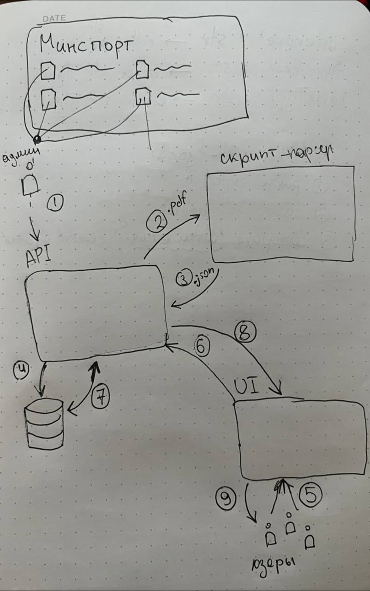

# one-zero-eight

Репозиторий проекта - https://github.com/hackathonsrus/pp_50040_pfo_ta_onezeroeight_69

Наше решение - система поиска и просмотра спортивных мероприятий из Единого календарного плана Минспорта России.
Основной пользователь - интересующийся спортом человек, который хочет узнать о предстоящих соревнованиях по интересующему его виду спорта.
Интерфейс выполнен в виде веб-приложения, где пользователь может использовать поле поиска или фильтры для поиска мероприятий.
Также есть возможность просмотра детальной информации о мероприятии или об отдельном виде спорта.
В качестве фронтенда используется фреймворк React с использованием библиотеки shadcn/ui.
В качестве бэкенда используется сервер на FastAPI, который обращается к базе данных MongoDB для выдачи данных о мероприятиях, а также обеспечивает аутентификацию пользователей.
На сервере предварительно загружаются данные из парсера, который берёт данные из pdf-файлов, размещенных на сайте Минспорта России.
Пользователь также может подписаться на получение уведомлений о предстоящих мероприятиях по интересующему его виду спорта или по конкретному мероприятию, разрешив уведомления в браузере.

## Диаграмма архитектуры

Используется база данных MongoDB для легкого горизонтального масштабирования.

Сервер FastAPI запускается через менеджер процессов Gunicorn, который способен запускать несколько воркеров для обработки запросов, что позволяет обрабатывать большое количество запросов.

Модульная архитектура приложения позволяет легко добавлять новый функционал и улучшать существующий.

## Скриншоты веб-интерфейса

